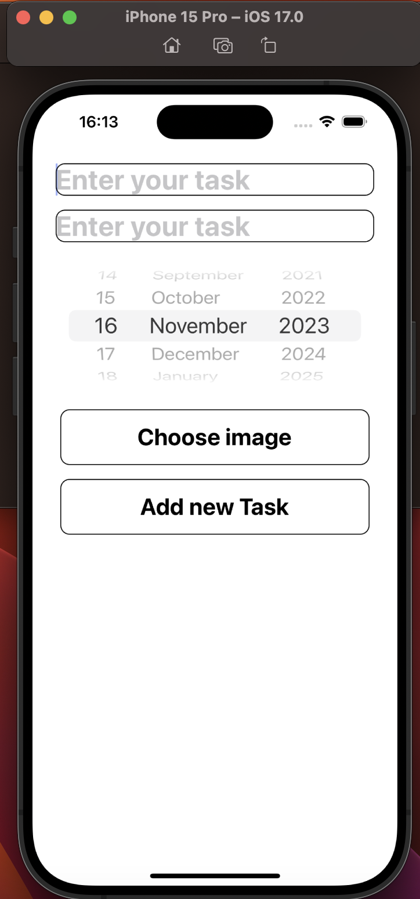
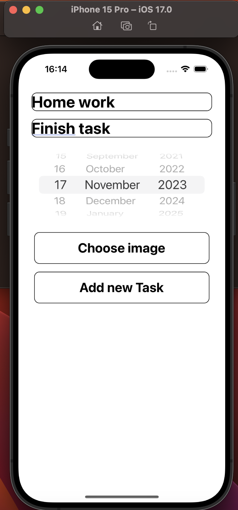
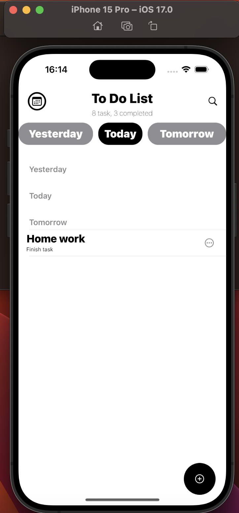

Hi! Welcome to the TodoApp project. 
I created this project to replenish my portfolio.

there are only two screens. And working with a tabular representation. I also work with Dates to save and execute data

Main screen of tasks

Sceen that adding tasks:

Then representing everything:

